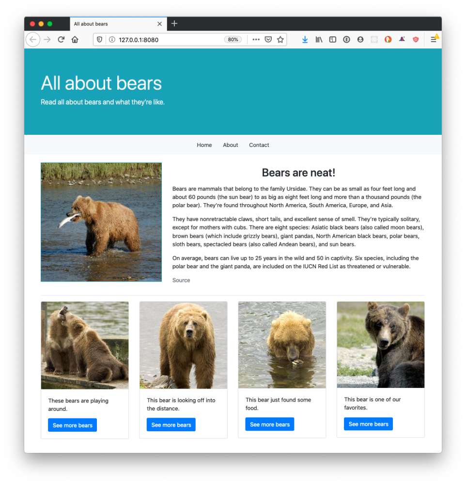
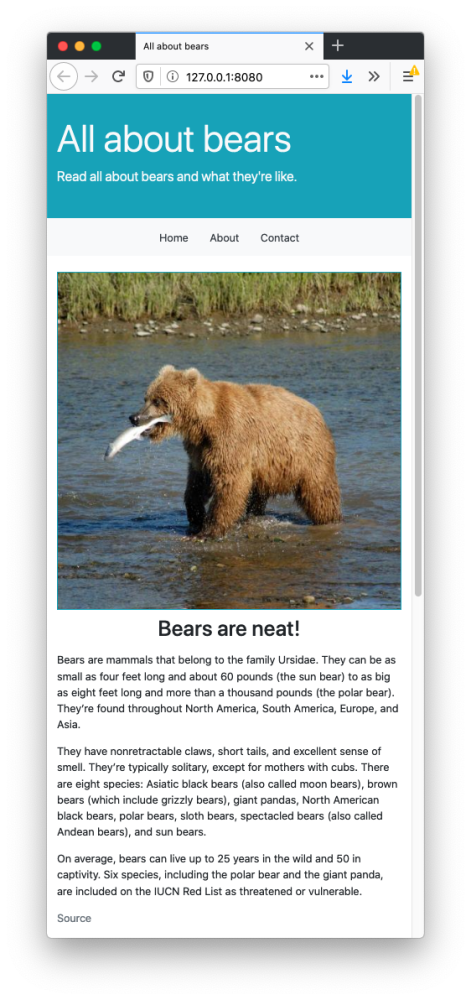
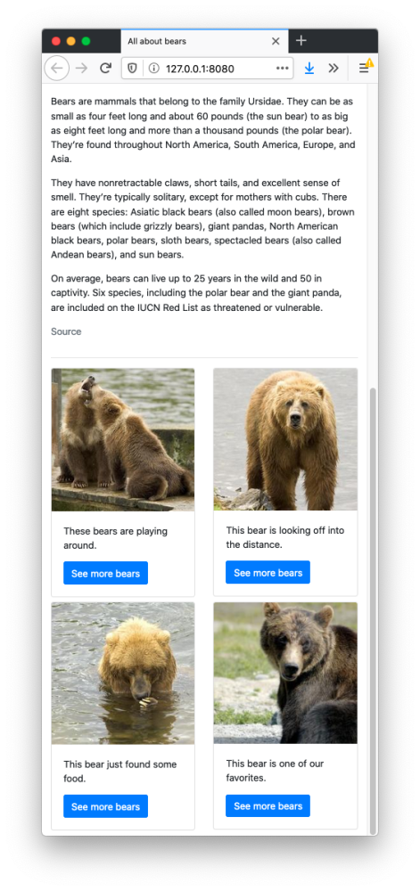

# CSS Frameworks: Assignment

## Assignment Instructions

To complete this assignment, you will need to build a website that looks similar to the one shown below. Your website _must_ conform to the following constraints:

- It must 100% rely on Twitter Bootstrap. You may have _no_ custom CSS.
- It should have a similar layout and color scheme to the example below.
- It should be responsive, as show below.

Your website does _not_ need to have the exact same content. You will be graded based off of your ability to recreate the layout, not your ability to use the exact text and images seen here.

### Desktop view

On a desktop, your website should look similar to the following. You can use the `md` breakpoint when deciding upon classes.



### Mobile view

On a smaller device, your layout should look similar to the following.





### Image resources

You are welcome to use whatever appropriate images you like. If you would like to use different bear content, you can use these [images from National Geographic](https://www.nationalgeographic.com/animals/mammals/group/bears-grizzly-polar-panda/) of several types of bears. Or maybe you'd like to use [these photos of kittens](http://placekitten.com/)! 

To use the images seen above, use the links below. You can also find the photos in the *Bear Images* folder in this repository.

```
https://placebear.com/490/480
https://placebear.com/225/225
https://placebear.com/225/224
https://placebear.com/225/223
https://placebear.com/225/222
```
## My Assignment Completion Notes

This assignment was originally supposed to be an excercise where I learned how to used Bootstrap effectively. I accomplished this style pretty quickly. It was also supposed to be about bears but I decided to make it about Dragonball. For that reason I left the bear pictures in the file. The content of the original was supposed to have Lorem Ipsum as the filler text aswell.

However I decided to have a little fun and come up with a concept for an application. It needed to be something that people would love to interact with. So I made it about Dragonball the popular anime series that has been dubbed one of the original top 3 animes of all time. I replaced all the images of where the bears where supposed to go while also typing up the content myself. 

### Issues During Project

I noticed once my design was complete that the text for my cards distorted my design. To solve this problem I used the class "text-truncate" I found in React's documentation. The "text-truncate" class makes the text in a selected element shorter using an ellipsis. This works but it isn't a true fix because now you can't read the rest of the card. I plan to come back to this project when I have more time in order to fix the minor things.
                                                                                                                                                                                                                                                                                                                                                                                                                          
